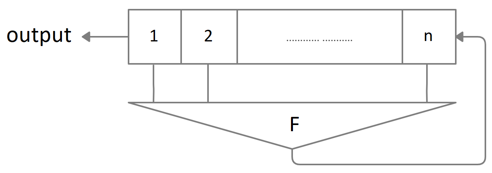
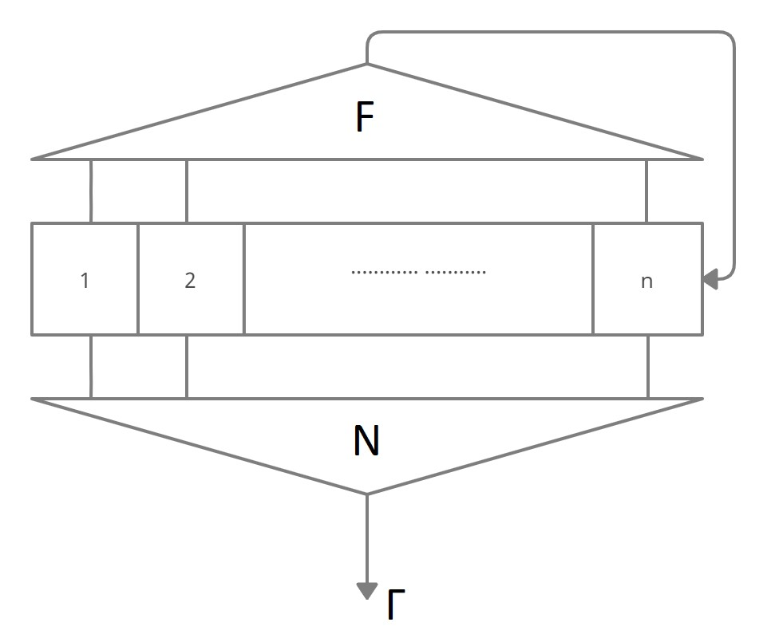
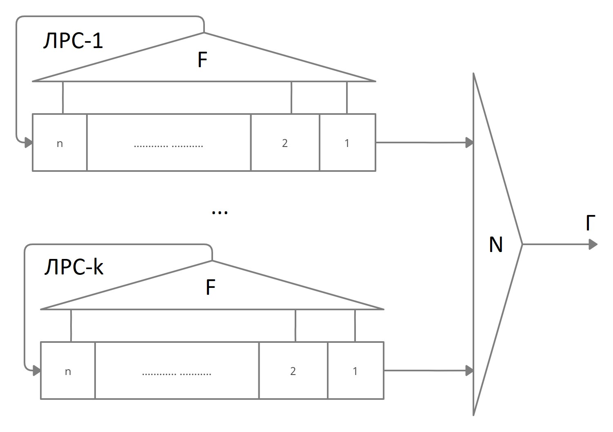

# Cryptographic pseudo-random sequence generators
Cryptographic generator - a mathematical algorithm used to obtain a pseudo-random sequence (gamma). Cryptographic generators are used to generate cryptosystem keys and gamma for stream encryption.

## Linear shift register (LSR)
The basic element of many crypto generators is a linear shift register with a max period length. The output gamma (linear recurrent sequence) of LSR has good statistical properties.  

$F$ - a linear function. LSR implement linear recurrent sequences (LRS). Usually F is chosen so that LRS has a max period.  
Despite the large period and good statistical quality, a significant drawback of linear shift registers is a simple analytical connection of the signs of output gamma and the initial state of the linear recurrent sequence. Therefore cryptographic applications use various ways of complicating linear recurrent sequences.

## Filter generator
One of the simplest ways to complicate a sequence over a finite set is to map its n-grams to another sequence using the filter function.  
Let P be a finite field. A filtering generator is an autonomous automaton $A=(P^n,P,h,N)$, where h is a linear substitution of the vector space $P^n$ implemented by n-length LSR over the P field with callback function $F(x)$. $N:P^n→P$ is a filtering function.  
A filter generator is called non-linear if the filter function is non-linear.  


## Combining generator
The combining generator is a complication of the filter generator. It's built on the basis of k > 1 LSRs over the $P$ field and the combining function $N:P^k→P$. The input of $N$ is the characters of linear recurrent sequences produced by LSRs.  
The combining generator is called non-linear if the combining function is non-linear.


# How To Use
* generators.py - implementation of LSR, filter and combining generator functions
* test.py - usage examples
## Input formats
* sequnce - binary string: 10...01
* linear function - Xi(xi) terms or digits splitted by '+': x1+5+x4
* unlinear function - Xi(xi) terms or digits splitted by '+' and '\*': x1\*x4+x5\*x7+x11+7  

Upper/lower register (X/x) supported. Multiplication without "\*" (like x1x2) not supported.  
Most of syntax input errors are handled by ``raise Error``. 

# Dedendecies
* Python 3.6+ (cause error outputs use F-strings)
* Python libraries:
```
pip install numpy
```
